**影像處理作業2**

學號：R13631011 姓名：陳冠廷
# **PART 2**
# **程式功能討論**
這段程式碼使用了 PyQt5 圖形介面工具包來建立一個圖像處理應用程式。程式結合了 OpenCV 和 Matplotlib 來處理和顯示影像，以及Numpy及計算影像的直方圖。主要功能包括讀取和顯示圖片與直方圖、進行各種影像處理操作（例如灰階轉換、直方圖計算）、以及調整影像亮度、對比度及灰階級數。
# **程式結構解析**
## **1. ImageProcessingApp 類別**
1. ## **主視窗 UI 啟動**
   1\. `\_\_init\_\_` 函式是這個應用程式的建構子，負責初始化視窗和設置主介面。它設置視窗標題為 "HW2 圖像處理軟體"，並將視窗尺寸設為 1500x900。
   2\. `initUI` 方法則負責設計和排列視窗中的元件。
1. ## **主視窗 UI 設置**
   1\. 使用 `QVBoxLayout` 設置主佈局，並將 UI 元素置中顯示 (`Qt.AlignCenter`)。
   2\. 設置字體為「微軟正黑體」，字型大小為 12，且加粗。
   3\. 建立了一個可滾動區域 (`QScrollArea`) 用於顯示圖片，避免圖片過大導致介面顯示不全。滾動區域內放置了一個容器 `widget`，用來包含顯示圖片的 `QLabel`。
   4\. `image\_label` 是用來顯示圖片的 QLabel 元件，設置為可忽略大小 (`QSizePolicy.Ignored`)，不會因圖片的大小而改變自身大小。
1. ## **各功能按鈕的創建與綁定事件**
   為每個按鈕指定文字說明並綁定對應的事件處理函式，例如：
   - 「載入並顯示彩色 BMP 或 JPEG圖片」按鈕綁定到 `load\_image` 方法，負責載入圖片。
   - 「使用兩種公式將圖片轉換為灰階 並使用圖像相減做比較結果顯示」按鈕綁定到 `convert\_to\_grayscale\_and\_compare` 方法，負責灰階處理。
   - 「顯示灰階直方圖」按鈕綁定到 `show\_histogram` 方法，負責顯示圖片的灰階直方圖。
   - 其他按鈕則分別對應不同的圖片處理功能，例如調整解析度、灰階級別、亮度與對比度、直方圖均衡化等。

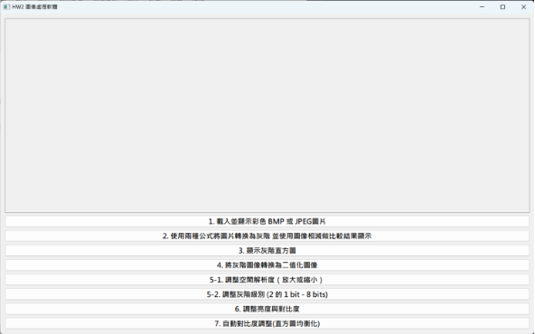

1. ## **載入圖片並顯示在主視窗上**
   `load\_image` 方法使用 `QFileDialog.getOpenFileName` 讓使用者選擇圖片檔案，支援 JPEG 和 BMP 格式。利用 OpenCV (`cv2.imread`) 讀取圖片，並呼叫 `display\_image` 方法將圖片顯示在 `image\_label` 上。
1. ## **顯示圖片的處理**
   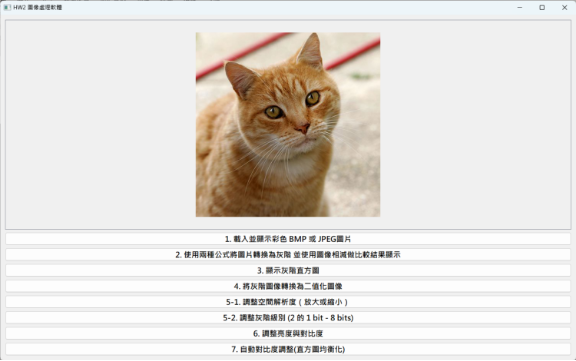`display\_image` 方法負責將 OpenCV 圖片轉換為 PyQt 可以處理的 `QImage`，並設定格式（RGB888 或 Grayscale8）。由於 OpenCV 使用 BGR 色彩空間，因此需呼叫 `rgbSwapped()` 方法轉換為 RGB 色彩空間。
   將 `QImage` 轉換為 `QPixmap`，並設置到 `image\_label` 上，確保圖片以原尺寸顯示。

- 載入範例圖片 並顯示圖片於主視窗

# **圖片處理功能說明**
## **1. 轉換圖片為灰階並比較使用兩種公式生成的灰階圖像**
此方法將載入的圖片轉換為灰階圖像，並比較兩種不同的灰階轉換公式所生成的結果：
\- 公式 A: GRAY = (R + G + B) / 3.0。此公式將 R、G、B 三個通道的值平均。
\- 公式 B: GRAY = 0.299\*R + 0.587\*G + 0.114\*B。此公式根據人眼對不同顏色的敏感度，給予每個通道不同的權重。
轉換後，將兩張灰階圖像顯示於彈出視窗中，並進行圖像相減以比較兩者之間的差異，將差異圖像顯示在主視窗上。

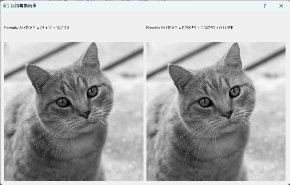

- 左圖為公式A 右圖為公式B

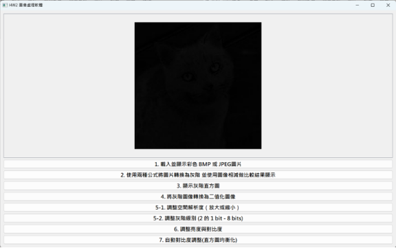

- 上圖為相減後結果圖顯示，仔細看會發現此結果圖有兩圖相減後的輪廓
## **2. 將 OpenCV 圖像轉換為 QPixmap**
此方法負責將 OpenCV 格式的圖像轉換為 PyQt 的 QPixmap，以便於在界面上顯示。若圖像為彩色，需進行 RGB 色彩空間轉換。
## **3. 計算並顯示灰階圖像對應之直方圖**
此方法將圖片轉換為灰階，並計算其灰階值的直方圖。利用 matplotlib 顯示直方圖，便於觀察灰階值的分佈情況。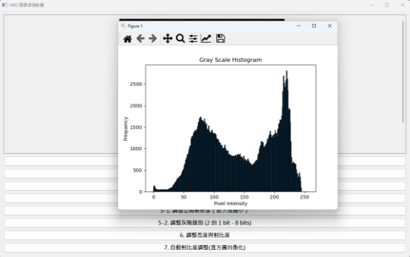

- 上圖為原圖轉灰階圖後的灰階直方圖

## **4. 將灰階圖像轉換為二值化圖像**
彈出一個對話框，讓使用者輸入閾值，並將圖片根據閾值將灰階圖像轉換為二值化圖像，像素值大於閾值的部分設為白色，否則設為黑色。最後將結果顯示在主視窗上。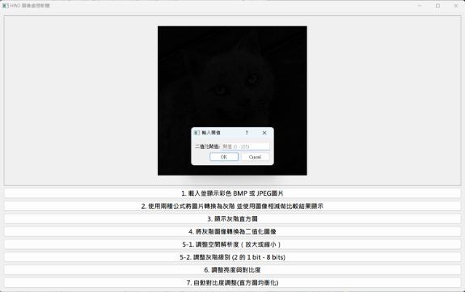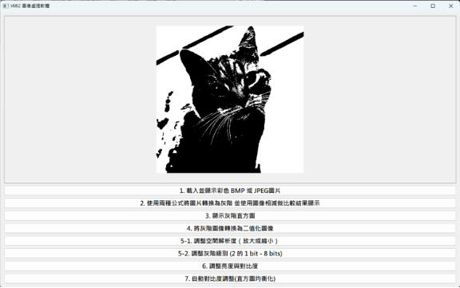

- 在彈出輸入閥值 128 將顯示以上結果
## **5. 彈出輸入放大或縮小倍數的對話框**
該方法會彈出一個對話框，讓使用者輸入空間解析度的放大或縮小倍數，並調整圖片的尺寸。使用最近鄰插值實現放大功能。

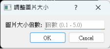
## **6. 調整空間解析度函數**
此方法根據輸入的倍數調整圖片的空間解析度，利用最近鄰插值法進行圖像放大或縮小，確保結果圖像的資料類型為 `uint8`，並在顯示時保持正確的範圍。

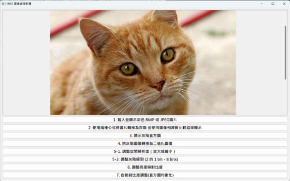

- 上圖為1.5被放大的結果顯示，過大的圖片可用滾輪查看

## **7. 彈出輸入灰階級別的對話框**
此方法彈出一個對話框，讓使用者輸入灰階級別，並呼叫 `adjust\_grayscale\_levels` 方法進行調整。

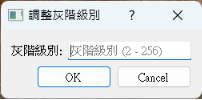
## **8. 調整灰階級別函數**
該方法將圖片轉換為灰階，並根據使用者輸入的灰階級別重新分佈灰階值。最後，顯示調整後的圖片。

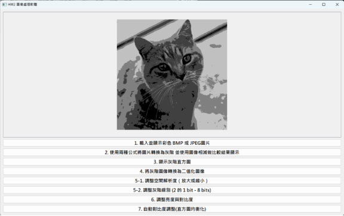

- 輸入灰階級別4 (2^2, 2bits) 將顯示以上結果

## **9. 彈出調整亮度與對比的對話框**
此方法將彈出一個對話框，讓使用者輸入欲調整的亮度與對比度。輸入完成後，會呼叫 `adjust\_brightness\_contrast` 方法進行調整。

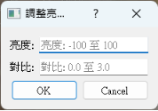
## **10. 調整圖片的亮度與對比度**
該方法接收使用者輸入的亮度與對比度值，並對圖片進行調整。使用 `np.clip()` 限制圖片像素值的範圍在 0-255 之間，確保結果不會溢出。

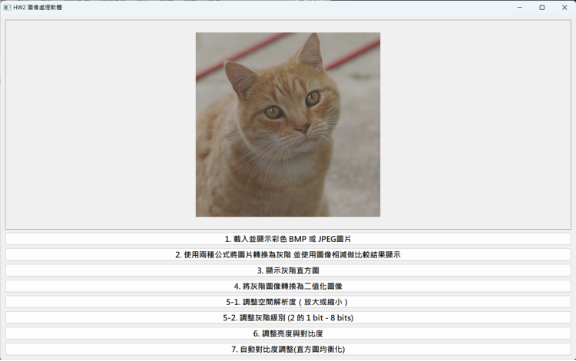

- 亮度 50  / 對比度 0.5

## **11. 直方圖均衡化函數（對三個通道均衡化）**
此方法對 R、G、B 三個通道分別進行直方圖均衡化，生成更高對比度的圖像。均衡化後的結果顯示在主視窗上，並計算與顯示均衡化後的灰階直方圖，以觀察結果。

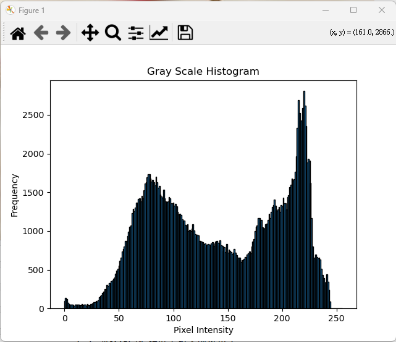

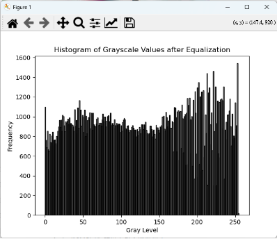

- 對比原灰階值方圖 結果有明顯均值化

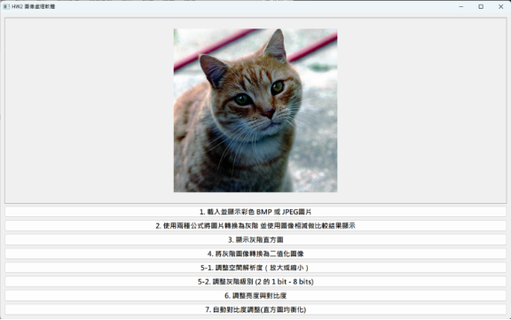

- 上圖為直方圖均衡化後的灰階圖像轉換為RGB圖的結果顯示
# **調整參數對話框功能說明**
對話框皆允許使用者輸入數值，並提供確認與取消按鈕。                                                             
並且在使用者輸入的數值超出範圍時，會顯示錯誤訊息提示。
----------------------------------------------
**1. BrightnessContrastDialog - 調整亮度與對比度的對話框**
\- 亮度範圍：-100 至 100。
\- 對比度範圍：0.0 至 3.0。
----------------------------------------------
**2. ResolutionDialog - 調整圖片大小的對話框**
\- 倍數範圍：0.1 到 5.0。
------------------------------------
**3. GrayscaleDialog - 調整灰階級別的對話框**
\- 灰階級別範圍：2 到 256。
-----------------------------------
**4. ThresholdDialog - 調整二值化閥值的對話框**
\- 閾值範圍：0 到 255。
------------------------------------
